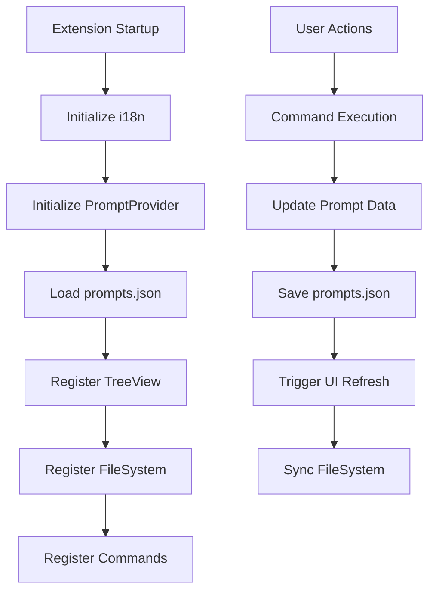

# Quick Prompt Development Guide

This document provides a complete guide for setting up the development environment and workflow for the Quick Prompt VS Code extension.

---

## 🛠️ Environment Setup

### System Requirements

* **Node.js** (Recommended v16 or above)
* **VS Code** (v1.75.0 or above)
* **TypeScript** (included in devDependencies)

### Setup Steps

#### 1. Project Initialization

```bash
# Clone the project and enter the directory
git clone https://github.com/winterdrive/QuickPrompt.git
cd QuickPrompt

# Install dependencies
npm install
```

#### 2. Compile TypeScript

```bash
# One-time compilation
npx tsc

# Or use npm script
npm run vscode:prepublish
```

#### 3. Start Development Mode

There are two ways to start development mode:

##### Method A: Use VS Code Debugging

1. Open the project folder in VS Code
2. Press `F5` or use the Command Palette (`Cmd+Shift+P` / `Ctrl+Shift+P`)
3. Select "Debug: Start Debugging"
4. A new Extension Development Host window will open

##### Method B: Use Command Line

```bash
# macOS/Linux
code --extensionDevelopmentPath=. --new-window

# Windows
code.cmd --extensionDevelopmentPath=. --new-window
```

#### 4. Live Development & Debugging

##### Start TypeScript Watch Mode

```bash
# Start TypeScript watch mode for auto-compilation
npx tsc --watch

# Or use VS Code tasks
# Press Cmd+Shift+P → "Tasks: Run Task" → "tsc: watch - tsconfig.json"
```

##### Reload the Extension

In the Extension Development Host window:

* Press `Cmd+R` (macOS) or `Ctrl+R` (Windows/Linux) to reload
* Or use Command Palette → "Developer: Reload Window"

---

## 📁 Project Structure

### Directory Overview

```text
QuickPrompt/
├── .vscode/               # VS Code config files
├── dist/                  # TypeScript build output
├── i18n/                  # Internationalization files
│   ├── en.json           # English messages
│   ├── zh-tw.json        # Traditional Chinese messages
│   └── zh-cn.json        # Simplified Chinese messages
├── src/                   # TypeScript source code
│   ├── ai/                # AI engine module
│   │   └── aiEngine.ts   # Local AI inference with Transformers.js
│   ├── extension.ts       # Extension entry (activate/deactivate)
│   ├── promptProvider.ts  # TreeDataProvider implementation
│   ├── promptFileSystem.ts # Virtual file system for editing prompts
│   ├── commands.ts        # Command handlers
│   ├── clipboardManager.ts # Clipboard history tracking
│   └── i18n.ts           # Internationalization utility
├── package.json           # Extension manifest
├── package.nls.json       # English localization (package.json)
├── package.nls.zh-tw.json # Traditional Chinese localization
├── package.nls.zh-cn.json # Simplified Chinese localization
├── tsconfig.json          # TypeScript config
├── README.md              # User guide
├── DEVELOPMENT.md         # This file
└── LICENSE                # MIT License
```

### Module Responsibilities

| Module File             | Description                                      | Main Class/Interface |
| ----------------------- | ------------------------------------------------ | -------------------- |
| `extension.ts`          | Extension lifecycle management, command registration | `activate()`, `deactivate()` |
| `promptProvider.ts`     | Implements `TreeDataProvider`, manages prompt data | `PromptProvider`, `PromptItem` |
| `promptFileSystem.ts`   | Virtual file system for editing prompts in native VSCode editor | `PromptFileSystemProvider` |
| `ai/aiEngine.ts`        | Local AI inference using Transformers.js and Qwen1.5-0.5B | `AIEngine` |
| `commands.ts`           | Command handlers for prompt and clipboard operations | Various handler functions |
| `clipboardManager.ts`   | Automatic clipboard history tracking | `ClipboardManager` |
| `i18n.ts`               | Internationalization utility, loads language files | `I18n` |

### Core Data Flow



---

## 🌍 Internationalization (i18n)

Quick Prompt supports multiple languages out of the box.

### Supported Languages

* **English** (`en`)
* **Traditional Chinese** (`zh-tw`)
* **Simplified Chinese** (`zh-cn`)

### How It Works

1. **package.json**: Uses `%key%` placeholders that reference `package.nls.json` files
2. **Runtime Messages**: Uses `I18n.getMessage()` to load strings from `i18n/*.json` files
3. **Auto-detection**: Automatically loads the correct language based on VS Code's locale setting

### Adding a New Language

1. Create `package.nls.[locale].json` (e.g., `package.nls.ja.json` for Japanese)
2. Create `i18n/[locale].json` (e.g., `i18n/ja.json`)
3. Translate all strings from the English versions
4. Test by setting VS Code locale to your language

---

## 🔧 Common Development Issues

### Q: Compile error "Cannot find module 'vscode'"

```bash
# Make sure the correct @types/vscode version is installed
npm install --save-dev @types/vscode@^1.75.0
```

### Q: Extension does not appear in Extension Development Host

* Check if the `main` field in `package.json` points to the correct build file
* Ensure TypeScript compiles without errors
* Check Developer Tools Console for errors

### Q: Code changes are not reflected

* Make sure TypeScript has recompiled (check the `dist/` folder)
* Reload the window in Extension Development Host (`Cmd+R`)

### Q: i18n strings not showing correctly

* Check if the language file exists in `i18n/` directory
* Verify the locale code matches VS Code's language setting
* Ensure `I18n.initialize()` is called in `activate()`

---

## 🔁 Data Flow & Architecture

### Prompt Data Structure

```typescript
interface Prompt {
    id: string;           // Unique ID (e.g., "001", "002")
    title: string;        // Prompt title
    content: string;      // Prompt content
    use_count: number;    // Usage count
    last_used: string;    // Last used date (ISO format)
    created_at: string;   // Creation date (ISO format)
    pinned?: boolean;     // Whether pinned
    order?: number;       // Manual sort order
    titleSource?: 'user' | 'ai';  // Title origin (user-entered or AI-generated)
}
```

### Storage Location

* **Workspace Mode**: `.vscode/prompts.json` (recommended, workspace-specific)
* **Fallback Mode**: Extension directory (when no workspace is open)

### Virtual File System

Quick Prompt uses a custom file system provider (`prompt-sniper://`) to allow editing prompts in the native VSCode editor:

* **URI Format**: `prompt-sniper://prompt/{id}.txt`
* **Two-way Sync**: Changes in the editor automatically update `prompts.json`
* **Native Experience**: Full VSCode editing features (syntax highlighting, undo/redo, etc.)

---

## 🚀 Publishing & Deployment

### Local Testing

1. Ensure TypeScript compiles without errors
2. Test all features in Extension Development Host
3. Check version and dependencies in package.json

### Package Extension

```bash
# Install vsce (Visual Studio Code Extension manager)
npm install -g vsce

# Package as .vsix file
vsce package

# Publish to VS Code Marketplace
vsce publish
```

### Version Management

```bash
# Update version
npm version patch  # Patch version (0.0.1 → 0.0.2)
npm version minor  # Minor version (0.0.1 → 0.1.0)
npm version major  # Major version (0.0.1 → 1.0.0)
```

---

## 🤝 Contribution Guide

### Development Workflow

1. Fork the project and create a feature branch
2. Follow the existing code style and architecture
3. Add appropriate comments and documentation
4. Test new features or fixes
5. Submit a Pull Request

### Code Style

* Use TypeScript strict mode
* Follow existing naming conventions
* Use JSDoc comments where appropriate
* Keep functions focused and modular

### Testing Checklist

* [ ] TypeScript compiles without errors
* [ ] All features work in Extension Development Host
* [ ] i18n strings work in all supported languages
* [ ] Virtual file system editing works
* [ ] Commands work from both sidebar and command palette
* [ ] Workspace isolation works correctly

---

## 📚 Resources

* [VS Code Extension API](https://code.visualstudio.com/api)
* [VS Code Extension Guidelines](https://code.visualstudio.com/api/references/extension-guidelines)
* [TreeView API Documentation](https://code.visualstudio.com/api/extension-guides/tree-view)
* [FileSystemProvider API](https://code.visualstudio.com/api/references/vscode-api#FileSystemProvider)
* [Internationalization Guide](https://code.visualstudio.com/api/working-with-extensions/publishing-extension#internationalization)
