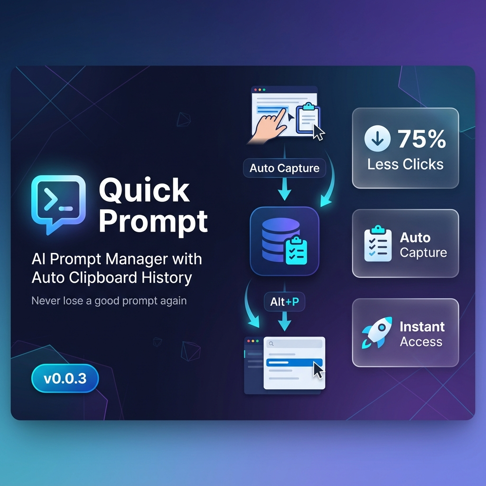
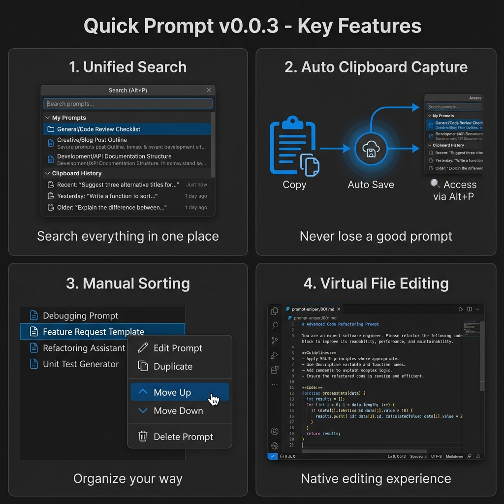
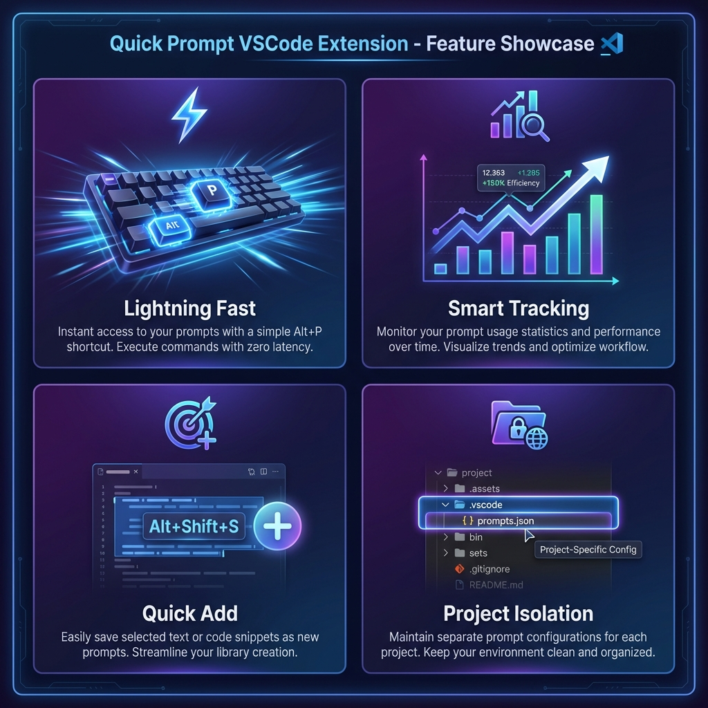
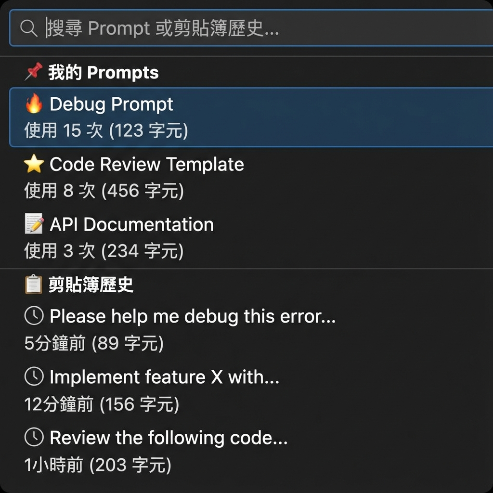
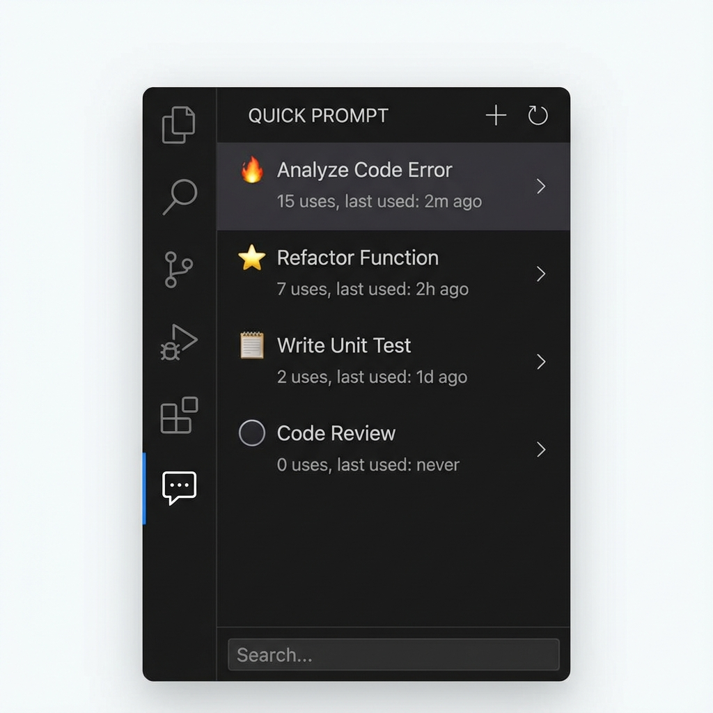

# Quick Prompt 🎯
>
> **[繁體中文](README.zh-TW.md)** | English

A lightweight VSCode extension for AI prompt management with automatic clipboard history tracking

## ✨ Key Features

- **🎯 Lightning Fast Search**: Press `Alt+P` to search prompts and clipboard history, hit Enter to copy
- **📋 Auto Clipboard History**: Automatically tracks your clipboard - never lose a good prompt again
- **📊 Smart Tracking**: Tracks usage count and last used time to identify your golden prompts
- **🚀 Quick Add**: Right-click selected text → "Quick Add Prompt" (or press `Alt+Shift+S`)
- **🎨 Visual Interface**: Sidebar displays popularity with icons (🔥/⭐/📝)
- **📁 Project Isolation**: Each workspace has its own independent prompt collection
- **⬆️⬇️ Manual Sorting**: Right-click to move prompts up or down
- **✏️ Native Editing**: Edit prompts like regular files with full VSCode support

📖 View Previous Version (Basic UI Reference)

### Feature Highlights (Previous Version)

*These images show the basic interface and core functionality that remains available in the current version.*

## 📸 Screenshots (AI Generated)

### Quick Search in Action

*Unified search interface for both prompts and clipboard history*

### Sidebar Management

*Organized view with prompts and clipboard history*

## 🚀 Quick Start

### First Time Setup

1. Open any project folder in VSCode
2. The extension will automatically create `.vscode/prompts.json`
3. Press `Alt+P` (Mac: `Opt+P`) to start using

### Basic Usage

#### Method 1: Quick Search (Recommended) ⚡

1. Press `Alt+P` to open the unified search
2. Browse **Prompts** and **Clipboard History** in one place
3. Type keywords to filter
4. Press `Enter` to copy to clipboard
5. Paste anywhere with `Ctrl+V`

#### Method 2: Sidebar Operations 📋

1. Click the Quick Prompt icon in the Activity Bar
2. **My Prompts** section:
   - Click to copy
   - Right-click to move up/down
   - Inline buttons: Copy, Pin, Edit, Delete
3. **Clipboard History** section:
   - Click to copy
   - Pin to convert to permanent prompt
   - Inline buttons: Copy, Pin, Edit, Delete

### Icon Meanings

- 🔥: Hot (used >= 10 times)
- ⭐: Frequent (used >= 5 times)
- 📝: Normal (used > 0 times)
- ⚪: Unused
- 📌: Pinned

## 📝 Managing Prompts

### Adding Prompts

#### Method 1: Add from Selection (Fastest) 🚀

1. Select text in the editor
2. Right-click → "Quick Add Prompt" (or press `Alt+Shift+S`)
3. Done! Title is auto-generated

#### Method 2: Smart Add Mode ⚡

1. Click **➕ Add** button in sidebar
2. In the input box:
   - **Auto Mode**: Paste content directly (auto-generates title)
   - **Manual Mode**: Use `Title::Content` format
3. Done!

#### Method 3: From Clipboard History

1. Find the item in Clipboard History
2. Click the **📌 Pin** button
3. Automatically converts to permanent prompt

### Editing Prompts

- Click the **✏️ Edit** button to open in native editor
- Edit like a regular file
- Press `Ctrl+S` to save
- Full support for Undo/Redo, Auto Save, Format Document

### Organizing Prompts

- **Pin**: Click **📌** to pin important prompts to the top
- **Sort**: Right-click → Move Up/Down to manually arrange
- **Delete**: Click **🗑️** to remove (no confirmation needed)

## 📋 Clipboard History

### Auto Capture

The extension automatically captures clipboard content from:

- **VSCode editor**: Instant capture when you copy
- **External apps**: Captured when you switch back to VSCode
- **Background polling**: Every 5 seconds (configurable)

### Smart Filtering

- ✅ Deduplication (no repeated entries)
- ✅ Minimum length filter (default: 10 characters)
- ✅ Excludes pure numbers
- ✅ Auto-clean old items (default: 7 days)

### Managing History

- **View**: Check recent items in sidebar
- **Copy**: Click to copy again
- **Pin**: Convert to permanent prompt
- **Edit**: Click edit to save as prompt and open editor
- **Delete**: Remove individual items
- **Clear All**: Click the clear button in sidebar title

## ⚙️ Configuration

### Settings

Open VSCode Settings and search for "Quick Prompt":

#### Clipboard History

- `quickPrompt.clipboardHistory.enabled`: Enable/disable auto tracking (default: `true`)
- `quickPrompt.clipboardHistory.maxItems`: Maximum history items (default: `20`)
- `quickPrompt.clipboardHistory.enablePolling`: Enable background polling (default: `true`)
- `quickPrompt.clipboardHistory.pollingInterval`: Polling interval in ms (default: `5000`)
- `quickPrompt.clipboardHistory.minLength`: Minimum content length (default: `10`)
- `quickPrompt.clipboardHistory.autoCleanDays`: Auto-clean after N days (default: `7`)

### File Location

- **Workspace Mode**: `.vscode/prompts.json` (independent per project)
- **Fallback Mode**: Uses extension directory if no workspace is open

### Keyboard Shortcuts

| Function        | Windows/Linux | Mac           |
|----------------|---------------|---------------|
| Search Prompt  | `Alt+P`       | `Opt+P`       |
| Add from Selection | `Alt+Shift+S` | `Opt+Shift+S` |

## 💡 Best Practices

1. **Save on the Fly**: See a useful prompt? Select and press `Alt+Shift+S`
2. **Use Clipboard History**: Don't worry about losing copied prompts - they're auto-saved
3. **Pin Important Ones**: Convert frequently used clipboard items to permanent prompts
4. **Organize Manually**: Use right-click to arrange prompts in your preferred order
5. **Version Control**: Add `.vscode/prompts.json` to Git to share with your team

## 🎯 Use Cases

### For AI Development

- Save frequently used ChatGPT/Copilot/Claude prompts
- Quick access to debugging prompts
- Organize code review templates

### For Content Creation

- Store writing prompts and templates
- Quick access to formatting instructions
- Manage translation prompts

### For Team Collaboration

- Share best prompts via Git
- Standardize team communication with AI
- Build a prompt library together

## 🌐 Internationalization

Quick Prompt supports multiple languages:

- 🇺🇸 English
- 🇹🇼 繁體中文 (Traditional Chinese)
- 🇨🇳 简体中文 (Simplified Chinese)

The extension automatically uses your VSCode language setting.

## 📄 License

MIT License

---

## 🤝 Recommended Companion

### 🗂️ VirtualTabs

**Enhance your AI workflow.**

**Quick Prompt** helps you manage *what* to tell the AI. Pair it with **VirtualTabs** to manage *where* the AI looks.

- **Manage Context**: Group related files across directories regardless of location.
- **AI-Ready**: Create precise file sets to paste into your LLM context.

[**Get VirtualTabs on VS Code Marketplace**](https://marketplace.visualstudio.com/items?itemName=winterdrive.virtual-tabs) | [**Open VSX Registry**](https://open-vsx.org/extension/winterdrive/virtual-tabs)

---

**Enjoy efficient prompt management!** 🚀

*Made with ❤️ for AI developers*
