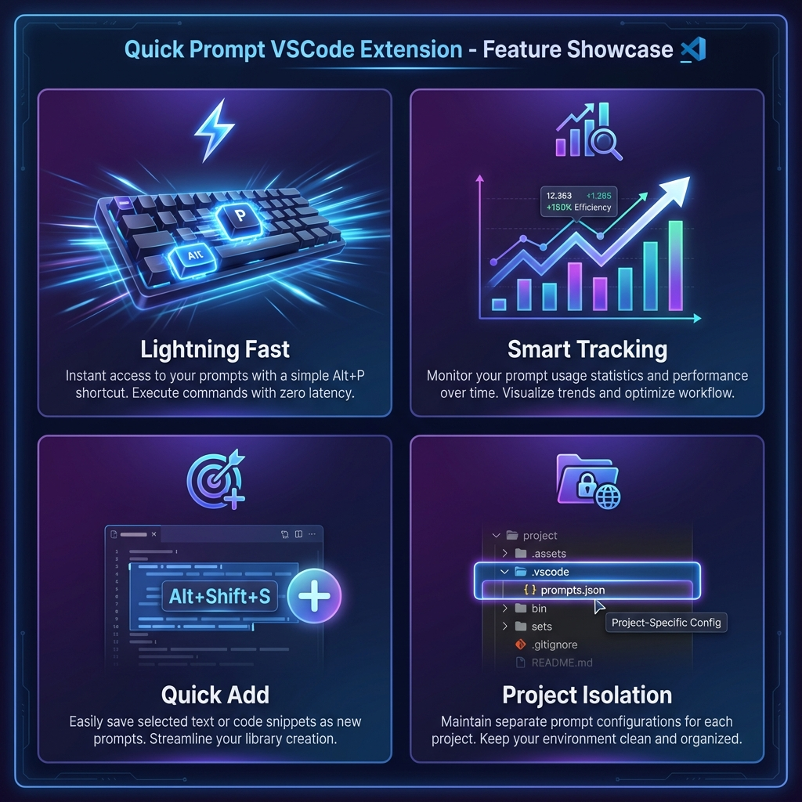
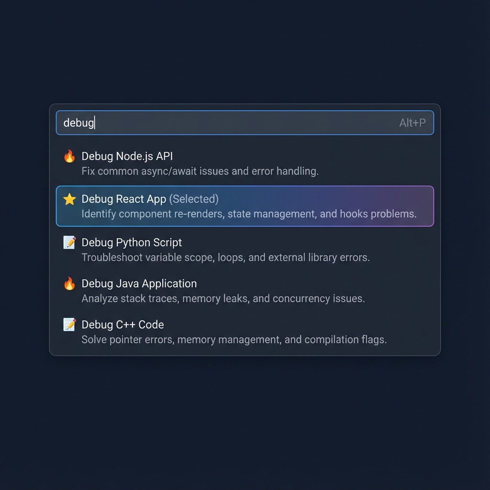
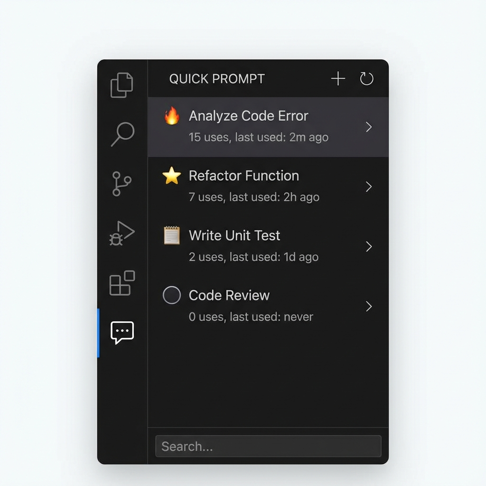

# Quick Prompt 🎯

快速管理和使用 Prompt 的 VSCode 擴充功能

## ✨ 核心特色

- **🎯 極速複製**：按 `Alt+P` 搜尋 Prompt，按 Enter 直接複製到剪貼簿
- **📊 智慧追蹤**：自動記錄使用次數和最後使用時間，找出您的黃金 Prompt
- **🚀 快速新增**：選取文字按 `Alt+Shift+S` 立即新增，或透過右鍵選單
- **🎨 視覺化介面**：側邊欄以圖示標示熱門程度（🔥/⭐/📝）
- **📁 專案隔離**：每個工作區有獨立的 Prompt 集合

## 📸 功能截圖

### 快速搜尋功能

### 側邊欄管理

## 🚀 快速開始

### 安裝後首次使用

1. 在 VSCode 中開啟任一專案資料夾
2. 擴充功能會自動在 `.vscode/prompts.json` 建立預設檔案
3. 按 `Alt+P`（Mac 使用 `Opt+P`）開始使用

### 基本操作

#### 方法一：快速搜尋（推薦）⚡

1. 按 `Alt+P` 開啟搜尋框
2. 輸入關鍵字篩選 Prompt
3. 按 `Enter` 複製到剪貼簿（自動增加使用次數）
4. 切換到任何地方（Copilot、Agent、瀏覽器等）按 `Ctrl+V` 貼上

#### 方法二：側邊欄操作 📋

1. 點擊活動列的 Quick Prompt 圖示（對話氣泡）
2. 點擊任一 Prompt 即可複製
3. 圖示說明：
    - 🔥：熱門（使用 >= 10 次）
    - ⭐：常用（使用 >= 5 次）
    - 📝：一般（使用 > 0 次）
    - ⚪：未使用

## 📝 新增 Prompt

### 方法 1：從選取文字新增（最快）🚀

1. 在編輯器中選取一段文字（您的 Prompt）
2. 按 `Alt+Shift+S`（或右鍵選擇「Quick Add Prompt (Selection)」）
3. 完成！自動生成標題並儲存

### 方法 2：智慧新增模式 ⚡

1. 點擊側邊欄標題列的 **➕ 新增** 按鈕（或執行命令 `Quick Prompt: 新增 Prompt`）
2. 在輸入框中：
    - **自動模式**：直接貼上內容，按 Enter（自動生成標題）
    - **手動模式**：使用 `標題::內容` 格式，例如：`Debug::請分析錯誤日誌...`
3. 完成！

**提示**：使用 `::` 分隔符可讓進階使用者一步完成，省去確認標題的步驟。

### 方法 3：手動編輯

編輯 `.vscode/prompts.json` 檔案。

## ⚙️ 設定

### 檔案位置

- **工作區模式**：`.vscode/prompts.json`（每個專案獨立）
- **備用模式**：如果沒有開啟工作區，會使用擴充功能目錄

### 快捷鍵

| 功能        | Windows/Linux | Mac           |
|-----------|---------------|---------------|
| 搜尋 Prompt | `Alt+P`       | `Opt+P`       |
| 從選取新增     | `Alt+Shift+S` | `Opt+Shift+S` |

## 💡 最佳實踐

1. **隨手存**：看到好用的 Prompt，直接選取並按 `Alt+Shift+S` 存起來
2. **養 Prompt**：多使用 Quick Prompt 複製，系統會自動標記熱門 Prompt
3. **版本控制**：將 `.vscode/prompts.json` 加入 Git，與團隊分享黃金 Prompt

## 📄 授權

MIT License

---

**享受高效的 Prompt 管理體驗！** 🚀
