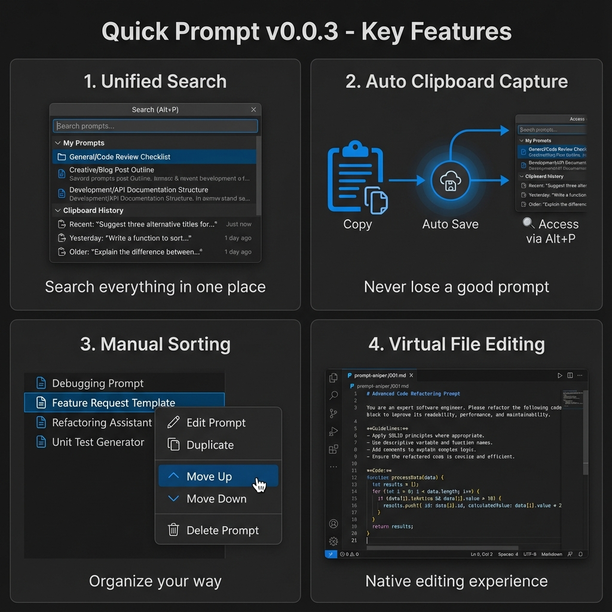
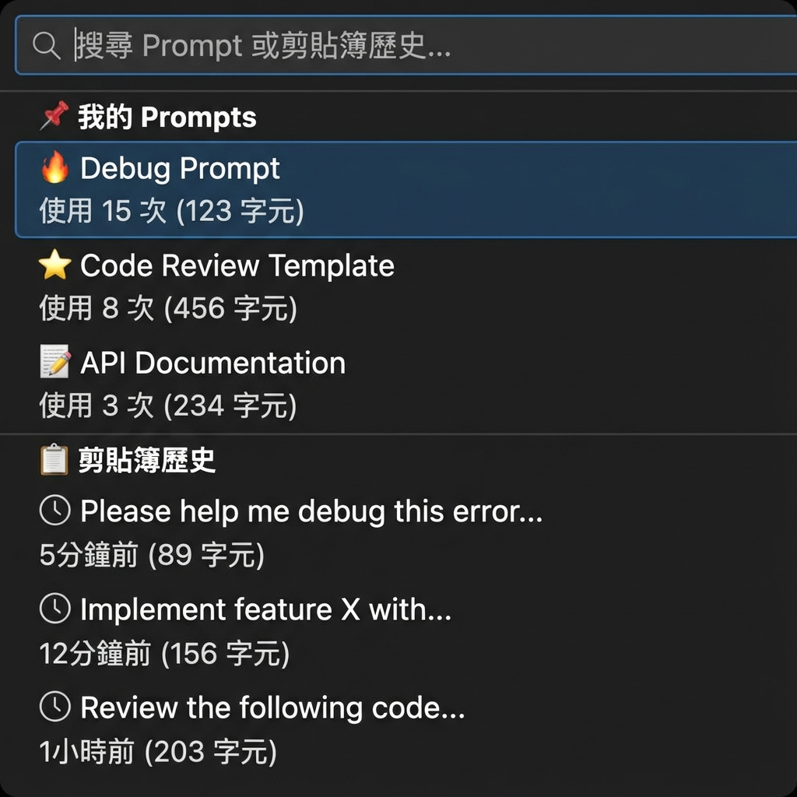

# Quick Prompt – VS Code AI 提示詞管理與剪貼簿歷史工具

繁體中文 | **[English](README.md)**

---

## 🚀 什麼是 Quick Prompt？

**Quick Prompt 是一個協助開發者管理、組織並即時存取 AI 提示詞與剪貼簿歷史的 VS Code 擴充功能。** 它結合了 **提示詞資料庫**
與 **剪貼簿追蹤**，讓您無需切換視窗，即可為 ChatGPT、Copilot 和 Claude 建立高品質的個人化提示詞庫。

---

### ⚡ 為什麼選擇 Quick Prompt？

| 功能特點     | 原生剪貼簿    | Quick Prompt 擴充套件     |
|:---------|:---------|:----------------------|
| **歷史紀錄** | 有限/無     | **自動歷史追蹤**            |
| **組織管理** | 無        | **自定義提示詞庫** (存為 JSON) |
| **快速存取** | 僅 Ctrl+V | **可搜尋介面** (Alt+P)     |

---

## ✨ 核心特色

- **🎯 極速複製**：按 `Alt+P` 搜尋 Prompt，按 Enter 直接複製到剪貼簿
- **📋 自動剪貼簿歷史**：自動追蹤您的剪貼簿 - 再也不會遺失好用的 Prompt
- **📊 智慧追蹤**：自動記錄使用次數和最後使用時間，找出您的黃金 Prompt
- **🚀 快速新增**：選取文字按 `Alt+Shift+S` 立即新增，或透過右鍵選單
- **🎨 視覺化介面**：側邊欄以圖示標示熱門程度（🔥/⭐/📝）
- **📁 專案隔離**：每個工作區有獨立的 Prompt 集合
- **⬆️⬇️ 手動排序**：右鍵點擊可上下移動 Prompt
- **✏️ 原生編輯**：像編輯一般檔案一樣編輯 Prompt，完整支援 VSCode 功能

📖 查看舊版本（基礎介面參考）

### 功能亮點（舊版本）

*這些圖片展示了目前版本仍保留的基礎介面和核心功能。*

## 📸 功能截圖 (AI 生成)

### 快速搜尋功能

### 側邊欄管理

## 🚀 快速開始

### 安裝後首次使用

1. 在 VSCode 中開啟任一專案資料夾
2. 擴充功能會自動在 `.vscode/prompts.json` 建立預設檔案
3. 按 `Alt+P`（Mac 使用 `Opt+P`）開始使用

### 基本操作

#### 方法一：快速搜尋（推薦）⚡

1. 按 `Alt+P` 開啟搜尋框
2. 輸入關鍵字篩選 Prompt
3. 按 `Enter` 複製到剪貼簿（自動增加使用次數）
4. 切換到任何地方（Copilot、Agent、瀏覽器等）按 `Ctrl+V` 貼上

#### 方法二：側邊欄操作 📋

1. 點擊活動列的 Quick Prompt 圖示（對話氣泡）
2. 點擊任一 Prompt 即可複製
3. 圖示說明：
    - 🔥：熱門（使用 >= 10 次）
    - ⭐：常用（使用 >= 5 次）
    - 📝：一般（使用 > 0 次）
    - ⚪：未使用

## 📝 新增 Prompt

### 方法 1：從選取文字新增（最快）🚀

1. 在編輯器中選取一段文字（您的 Prompt）
2. 右鍵選擇「Quick Add Prompt (Selection)」（或按 `Alt+Shift+S`）
3. 完成！自動生成標題並儲存

### 方法 2：智慧新增模式 ⚡

1. 點擊側邊欄標題列的 **➕ 新增** 按鈕（或執行命令 `Quick Prompt: 新增 Prompt`）
2. 在輸入框中：
    - **自動模式**：直接貼上內容，按 Enter（自動生成標題）
    - **手動模式**：使用 `標題::內容` 格式，例如：`Debug::請分析錯誤日誌...`
3. 完成！

**提示**：使用 `::` 分隔符可讓進階使用者一步完成，省去確認標題的步驟。

### 方法 3：手動編輯

編輯 `.vscode/prompts.json` 檔案。

## ⚙️ 設定

### 檔案位置

- **工作區模式**：`.vscode/prompts.json`（每個專案獨立）
- **備用模式**：如果沒有開啟工作區，會使用擴充功能目錄

### 快捷鍵

| 功能        | Windows/Linux | Mac           |
|-----------|---------------|---------------|
| 搜尋 Prompt | `Alt+P`       | `Opt+P`       |
| 從選取新增     | `Alt+Shift+S` | `Opt+Shift+S` |

## 💡 最佳實踐

1. **隨手存**：看到好用的 Prompt，直接選取並按 `Alt+Shift+S` 存起來
2. **養 Prompt**：多使用 Quick Prompt 複製，系統會自動標記熱門 Prompt
3. **版本控制**：將 `.vscode/prompts.json` 加入 Git，與團隊分享黃金 Prompt

---

## 🤝 推薦搭配

### 🗂️ VirtualTabs

**提升您的 AI 工作流程。**

**Quick Prompt** 幫助您管理*要告訴 AI 什麼*。搭配 **VirtualTabs** 來管理 *AI 要看哪些檔案*。

- **管理上下文**：將不同目錄的相關檔案分組，不受位置限制。
- **AI 就緒**：建立精確的檔案集合，輕鬆貼入 LLM 上下文。

[**在 VS Code Marketplace 取得 VirtualTabs
**](https://marketplace.visualstudio.com/items?itemName=winterdrive.virtual-tabs) | [**Open VSX Registry
**](https://open-vsx.org/extension/winterdrive/virtual-tabs)

---

## 📄 授權

MIT License

---

**享受高效的 Prompt 管理體驗！** 🚀
