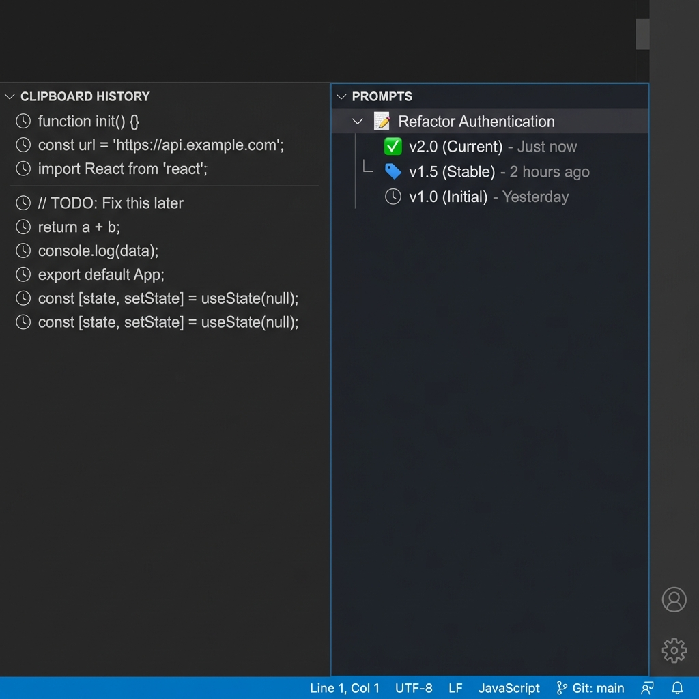
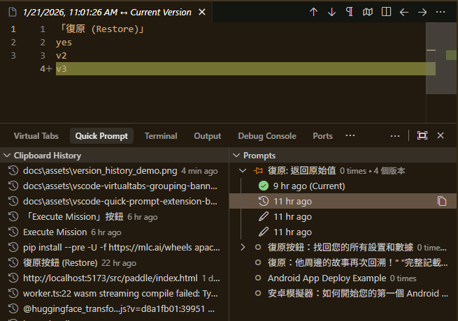

# Quick Prompt – VS Code AI 提示詞管理與剪貼簿歷史工具

繁體中文 | **[English](README.md)**

---

## 🚀 什麼是 Quick Prompt？

**Quick Prompt 是一個協助開發者管理、組織並即時存取 AI 提示詞與剪貼簿歷史的 VS Code 擴充功能。** 它結合了 **提示詞資料庫**
與 **剪貼簿追蹤**，讓您無需切換視窗，即可為 ChatGPT、Copilot 和 Claude 建立高品質的個人化提示詞庫。

---

## 🔥 v0.2.0 重大更新：版本歷史系統

**不再遺失任何一次 Prompt 的迭代。** 全新的版本歷史系統會自動為您追蹤每一次變更。

### 核心功能

- **🕒 線性歷史**：每次儲存自動建立新版本。
- **📌 里程碑**：標記穩定版本或重要草稿。
- **↩️ 軟還原**：安全地預覽並還原舊版本，不會立即覆蓋現有檔案。

### ⚖️ 差異檢視 (Diff View)

一鍵比較歷史版本與當前狀態的差異。在還原之前，透過視覺化比對確認每一個修改細節。

---

## ✨ 核心特色

### 📚 提示詞管理 (Prompt Management)

- **🤖 AI 智慧標題**：使用本地 AI 模型 (Qwen1.5-0.5B) 自動生成語義化標題。
- **🎯 極速搜尋**：按 `Alt+P` 搜尋 Prompt，按 Enter 直接複製。
- **🚀 快速新增**：選取文字按 `Alt+Shift+S` 立即新增。
- **🎨 視覺化介面**：側邊欄以圖示標示熱門程度（🔥/⭐/📝）。
- **✏️ 原生編輯**：像編輯一般檔案一樣編輯 Prompt，完整支援 VSCode 功能。

### 🕒 版本控制 (Version Control) - New

- **全面追蹤**：記錄每一次變更。
- **智慧保留**：自動清理過渡性的編輯紀錄，同時保留重要里程碑。
- **差異比對**：視覺化檢視修改內容。

### 📋 剪貼簿歷史 (Clipboard History)

- **自動追蹤**：自動記錄 VSCode 內外的複製內容。
- **智慧分析**：記錄使用次數與時間，找出您的黃金 Prompt。
- **專案隔離**：每個工作區擁有獨立的 Prompt 集合。

## 📸 功能截圖 (AI 生成)

### 快速搜尋功能

### 側邊欄管理

## 🚀 快速開始

### 安裝後首次使用

1. 在 VSCode 中開啟任一專案資料夾
2. 擴充功能會自動在 `.vscode/prompts.json` 建立預設檔案
3. 按 `Alt+P`（Mac 使用 `Opt+P`）開始使用

### 基本操作

#### 方法一：快速搜尋（推薦）⚡

1. 按 `Alt+P` 開啟搜尋框
2. 輸入關鍵字篩選 Prompt
3. 按 `Enter` 複製到剪貼簿（自動增加使用次數）
4. 切換到任何地方（Copilot、Agent、瀏覽器等）按 `Ctrl+V` 貼上

#### 方法二：側邊欄操作 📋

1. 點擊活動列的 Quick Prompt 圖示（對話氣泡）
2. **My Prompts** 區塊：
    - 點擊任一 Prompt 即可複製
    - 右鍵點擊可上下移動
    - 行內按鈕：複製、釘選、編輯、刪除
3. **Clipboard History** 區塊：
    - 點擊即可複製
    - 點擊釘選圖示可轉為永久 Prompt

### 圖示說明

- 🔥：熱門（使用 >= 10 次）
- ⭐：常用（使用 >= 5 次）
- 📝：一般（使用 > 0 次）
- ⚪：未使用
- 📌：已釘選

## 📝 新增與編輯

### 新增 Prompt

#### 方法 1：從選取文字新增（最快）🚀

1. 在編輯器中選取一段文字
2. 右鍵選擇「Quick Add Prompt (Selection)」（或按 `Alt+Shift+S`）
3. 完成！自動生成標題並儲存

#### 方法 2：智慧新增模式 ⚡

1. 點擊側邊欄標題列的 **➕ 新增** 按鈕
2. 在輸入框中：
    - **自動模式**：直接貼上內容，按 Enter（自動生成標題）
    - **手動模式**：使用 `標題::內容` 格式
3. 完成！

#### 方法 3：從剪貼簿歷史

1. 在 Clipboard History 找到該項目
2. 點擊 **📌 釘選** 按鈕
3. 自動轉為永久 Prompt

### 編輯 Prompt

- 點擊 **✏️ 編輯** 按鈕開啟原生編輯器
- 像編輯一般檔案一樣修改內容
- 按 `Ctrl+S` 儲存
- 支援復原/重做 (Undo/Redo)、自動儲存、格式化文件

### 使用版本歷史 (最新功能)

1. **查看歷史**：在側邊欄展開任何 Prompt。
2. **比較**：點擊任何歷史版本開啟 **Diff View**。
3. **還原**：右鍵點擊版本並選擇 **套用版本** 來還原。
4. **里程碑**：將重要版本標記為里程碑（如 "v1.0 正式版"）。

## ⚙️ 設定

### AI 功能設定

- `quickPrompt.ai.enabled`: 啟用/停用 AI 功能（預設：`true`）
- `quickPrompt.ai.autoGenerateTitle`: 自動生成標題（預設：`true`）

### 剪貼簿設定

- `quickPrompt.clipboardHistory.enabled`: 啟用/停用自動追蹤（預設：`true`）
- `quickPrompt.clipboardHistory.maxItems`: 最大歷史紀錄數量（預設：`20`）
- `quickPrompt.clipboardHistory.minLength`: 最小內容長度（預設：`10`）

### 檔案位置

- **工作區模式**：`.vscode/prompts.json`（每個專案獨立）
- **備用模式**：如果沒有開啟工作區，會使用擴充功能目錄

### 快捷鍵

| 功能        | Windows/Linux | Mac           |
|-----------|---------------|---------------|
| 搜尋 Prompt | `Alt+P`       | `Opt+P`       |
| 從選取新增     | `Alt+Shift+S` | `Opt+Shift+S` |

## 💡 最佳實踐

1. **隨手存**：看到好用的 Prompt，直接選取並按 `Alt+Shift+S` 存起來
2. **無壓複製**：不用擔心遺失複製過的內容，剪貼簿歷史都會幫您留著
3. **建立里程碑**：為您的 "黃金 Prompt" 建立版本里程碑，隨時可回溯
4. **共享協作**：將 `.vscode/prompts.json` 加入 Git，與團隊分享

## 🤝 推薦搭配

### 🗂️ VirtualTabs

**提升您的 AI 工作流程。**

**Quick Prompt** 幫助您管理*要告訴 AI 什麼*。搭配 **VirtualTabs** 來管理 *AI 要看哪些檔案*。

- **管理上下文**：將不同目錄的相關檔案分組，不受位置限制。
- **AI 就緒**：建立精確的檔案集合，輕鬆貼入 LLM 上下文。

在 [**VS Code Marketplace**](https://marketplace.visualstudio.com/items?itemName=winterdrive.virtual-tabs?utm_source=quickprompt&utm_medium=readme&utm_campaign=cross_promotion) | [**Open VSX Registry**](https://open-vsx.org/extension/winterdrive/virtual-tabs?utm_source=quickprompt&utm_medium=readme&utm_campaign=cross_promotion) 取得 VirtualTabs

---

## ❤️ 支持專案

如果您覺得這個擴充功能對您有幫助，歡迎小額贊助支持開發！

## 📄 授權

MIT License

---

**享受高效的 Prompt 管理體驗！** 🚀

*Made with ❤️ for AI developers*
